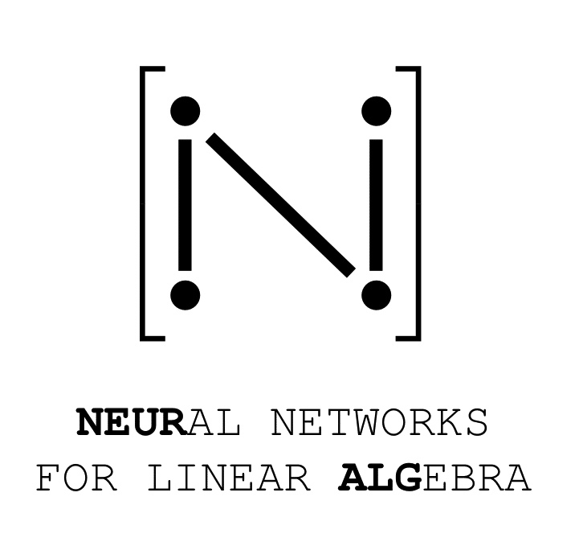

# neuralg
<!-- PROJECT LOGO -->
<br />
<p align="center">
  <a href="https://github.com/gomezz/neuralg">
    
  </a>
  <p align="center">
    Neural network approximators of linear algebra operations on GPU with PyTorch
    <br />
    <a href="https://github.com/gomezzz/neuralg/notebooks/example_problem.ipynb">View Example notebook</a> <!-- Update for final version -->
  </p>
</p>


<!-- TABLE OF CONTENTS -->
<details open="open">
  <summary>Table of Contents</summary>
  <ol>
    <li>
      <a href="#about">About</a>
      <ul>
        <li><a href="#built-with">Built With</a></li>
      </ul>
    </li>
    <li>
      <a href="#getting-started">Getting Started</a>
      <ul>
        <li><a href="#prerequisites">Prerequisites</a></li>
        <li><a href="#installation">Installation</a></li>
      </ul>
    </li>
    <li><a href="#usage">Usage</a>
     <ul>
        <li><a href="#small-example">Small example</a></li>
        <li><a href="#support-and-training-distributions">Support and training distributions</a></li>
        <li><a href="#available-models-">Available models</a></li>
      </ul>
    </li>
    <li><a href="#goals">Goals</a></li>
    <li><a href="#contributing">Contributing</a></li>
    <li><a href="#license">License </a>
    </li>
  <ol>
</details>

<!-- ABOUT THE PROJECT -->
## About 

The `neuralg` module is a neural-network-based collection of approximators for common numerical linear algebra operations such as eigenvalue or singular value computation. It allows utilizing GPUs for differentiable and efficient computation with [PyTorch](https://pytorch.org/). This also supports maintaining stable gradient flows. 

The software is free to use and is designed for the machine learning community in general, and users focusing on topics involving numerical linear algebra in particular.


### Built With

This project is built with the following packages:

* [PyTorch](https://pytorch.org/), implying full differentiability and can be used for machine learning


<!-- GETTING STARTED -->
## Getting Started

Below is a short guide for setting up neuralg on your device.

### Prerequisites
Users who want to use the GPU needs to set up CUDA including installing a [cudatoolkit](https://developer.nvidia.com/cuda-downloads).
### Installation

To install neuralg via pip, run
   ```sh
   pip install neuralg
   ```

Note that *pip* will **not** set up PyTorch with CUDA and GPU support. <!-- Double check for final version-->

**GPU Utilization**
To set up the GPU version of PyTorch, please refer to installation procedures at [PyTorch Documentation](https://pytorch.org/get-started/locally/)


<!-- USAGE EXAMPLES -->
## Usage

### Small example
The neuralg module is designed to resemble existing, commonly used numerical linear algebra libraries. Below is a small example showing how neuralg can be used to approximate the eigenvalues of a batch of random matrices. For a more elaborate and interactive example, please refer to the jupyter notebook [example problem](https://github.com/gomezzz/neuralg/notebooks/example_problem.ipynb). <!-- Change this link when public repo-->

```python

import torch 
import neuralg 
from neuralg import eigvals
# Enable GPU support if available 
neuralg.set_up_torch(torch_enable_cuda = True)

# Sample a batch of matrices with uniform iid coefficients
# Note that neuralg only supports input of tensor type 
batch_size, matrix_size = 10000, 5
matrix_batch = torch.rand(batch_size,matrix_size,matrix_size)

# Call neuralg to approximate eigenvalues 
eigvals = eigvals(matrix_batch) # outputs are torch.complexfloat dtype

# Construct symmetric matrices
symmetric_matrix_batch = torch.triu(matrix_batch, 0) + torch.transpose(torch.triu(matrix_batch, 1),1,2) 
# Symmetric matrices have specialized appproximators
eigvals_sym =  eigvals(symmetric_matrix_batch, symmetric = True) # output are torch.float dtype

```

### Support and training distributions
Built with PyTorch and targeting GPU utilization, neuralg only supports input of type `torch.Tensor`. The current version of neuralg supports real valued input matrices. Current available models have been trained and evaluated on random square matrices. For details, see specifications for corresponding operations and matrix types. 
|     **function call**     | **supported dtypes**                                                  | **supported sizes** |                                                              **training matrix distribution**                                                              |
|:-------------------------:|-----------------------------------------------------------------------|:-------------------:|:----------------------------------------------------------------------------------------------------------------------------------------------------------:|
| `eig(x,symmetric = True)` | float32 (in / out), float64 (in / out)                               |        [2,20]       | Real valued symmetric with i.i.d. centered normally distributed eigenvalues with variance 100/3 and eigenvectors uniformly distributed on the unit sphere. |
|    `eig(x,real = True)`   | float32 (in / out), float64 (in / out)                               |        [2,10]       |                              Real valued asymmetric with i.i.d. centered normally distributed eigenvalues with variance 100/3.                             |
|          `eig(x)`         | float32 (in), float64 (in), complexfloat64 (out), complexfloat128(out) |        [2,5]        |                                             Real valued with i.i.d. uniformly distributed elements on [-10,10].                                            |
|          `svd(x)`         | float32 (in / out), float64 (in / out)                               |        [2,20]       |                                             Real valued with i.i.d. uniformly distributed elements on [-10,10].                                            |                                    |

### Available models
All current available models are listed below. The nerf type models are implementations of architecture from [NeRF: Representing Scenes as Neural Radiance Fields for View Synthesis](https://arxiv.org/pdf/2003.08934.pdf)
| **model name** | **model type** | **hyper parameters** | **Additional information** |
|:---:|:---:|:---:|:---:|
| [EigNERF](https://github.com/gomezzz/neuralg/blob/main/neuralg/models/nerf.py) | [nerf](https://github.com/darioizzo/geodesyNets/blob/master/gravann/networks/_nerf.py) | 8 hidden layers, 200 neurons, skips at layers [2,4,6] |  |
| [CEigNERF](https://github.com/gomezzz/neuralg/blob/main/neuralg/models/nerf.py) |  complex nerf, based on [nerf](https://github.com/darioizzo/geodesyNets/blob/master/gravann/networks/_nerf.py) | 8 hidden layers, 200 neurons, skips at layers [2,4,6] | Outputs are complex valued |<!-- Change this link when public repo-->
#### Customizing and adding models
Additionally, neuralg supports training models from scratch or re-training and fine tuning existing models, depending on specific user applications. It is also possible to introduce new model architectures to expand the module. Please refer to the [tutorial](https://github.com/gomezzz/neuralg/notebooks/training_tutorial.ipynb) for a thorough how-to guide. <!-- Change this link when public repo-->
<!-- CONTRIBUTING -->
## Contributing

The project is open to community contributions. Feel free to open an [issue](https://github.com/esa/neuralg/issues) or write us an email if you would like to discuss a problem or idea first.

If you want to contribute, please proceed according to:

1. Fork the project on [GitHub](https://github.com/esa/neuralg). 
2. Get the most up-to-date code by installing neuralg from source:
     1. Get [miniconda](https://docs.conda.io/en/latest/miniconda.html) or similar
     2. Clone the repo
      ```sh
      git clone https://github.com/esa/neuralg.git
      ```
     3. Setup the environment. This will create a conda environment called `neuralg`
      ```sh
      conda env create -f environment.yml
      conda activate neuralg
      ```

After cloning the repository, developers can check the functionality of `neuralg` by running the following command in the root directory: <!-- Double-check in final version -->

```sh
pytest
```

Now you are all set to contribute. PRs should be created from and into the `develop` branch. For each release the develop branch is merged into main.

3. Create your Feature Branch (`git checkout -b feature/NewFeature`)
4. Commit your Changes (`git commit -m 'Add some NewFeature'`)
5. Push to the Branch (`git push origin feature/NewFeature`)
6. Open a Pull Request on the `develop` branch, *not* `main` 

and we will have a look at your contribution as soon as we can. 

Furthermore, please make sure that your PR passes all automated tests, after which the contribution will be revire. Only PRs created on the `develop` branch with all tests passing will be considered.
<!-- GOALS -->
## Goals

* **Proof of concept**: Recent years of rapid advances in machine learning aside, neural network models are yet to reach competitive results in the field of numerical linear algebra. Some attention has been paid to the subject, e.g. with [parameter rich transformers](https://arxiv.org/pdf/2112.01898.pdf). neuralg serves as a demonstration of a competitive small-scale approach, with the goal of mitigating issues with memory and time complexity related to larger models.
* **Supporting science**: Linear algebra problems serve as fundamental computational components in countless science and engineering applications. Eigenvalue and singular value decompositions, solving linear system of equations and matrix inversion appear as essential parts of solutions in  optimization, dynamical systems, signal processing etc. Ultimately, neuralg aims to provide useful tools to researchers within these fields, with a focus on parallell computation.
* **Addressing efficient vectorization**: The nature of classical numerical algorithms for linear algebra operations are often iterative and difficult to vectorize efficiently on GPUs and specialized machine learning hardware. Existing built-in libraries often synchronize with CPU, which can severly slow down computation. To this end, neuralg aims to allow users to exploit the computational benefits from GPU parallelization on targeted hardware.

## License

Distributed under the GPL-3.0 License. See [LICENSE](https://github.com/gomezzz/neuralg/LICENSE) <!-- Change this link -->for more information.